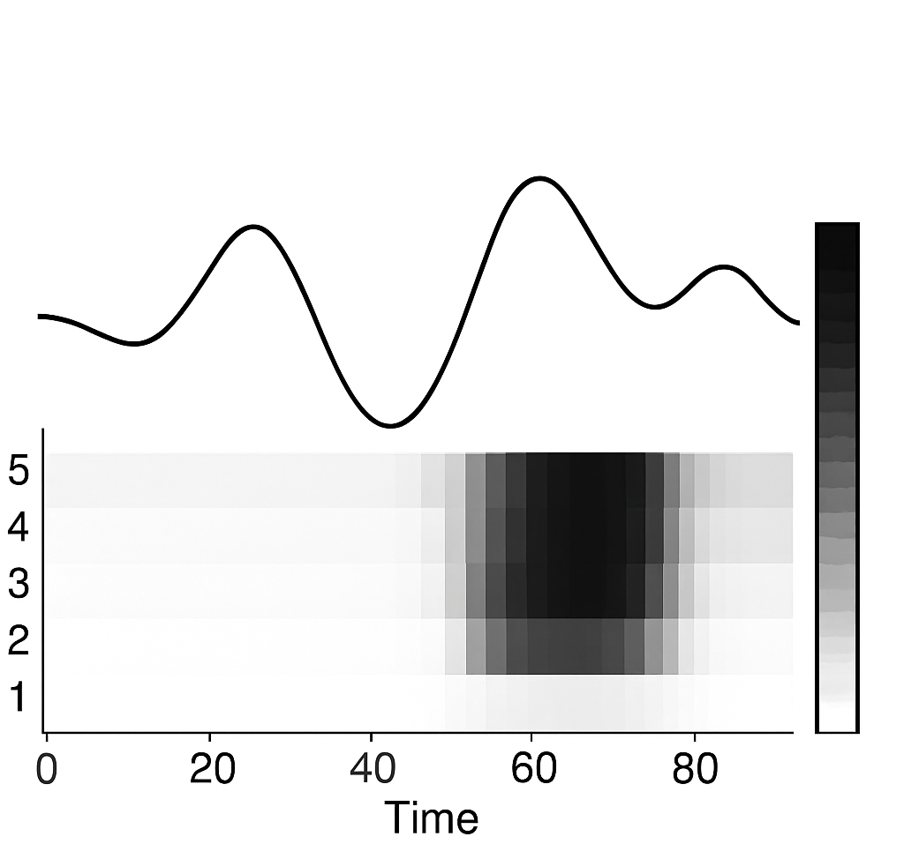

# TrustGuardAI

**Explainable Real-Time Anomaly Detection Framework for Time-Series Sensor Data**

TrustGuardAI is a single-file Python implementation that trains a streaming LSTM autoencoder, computes feature-level attention attributions, and generates calibrated confidence scores via Monte Carlo dropout. It processes sliding windows of multivariate sensor streams in real time and outputs anomaly flags, anomaly scores, and an attention heatmap.

---

## 🚀 Key Features

- **Streaming Inference**  
  Processes one window at a time, preserving LSTM hidden states—no full-batch retraining needed.

- **Explainability**  
  Learnable attention weights highlight which time-steps and features drove the anomaly decision.

- **Uncertainty Quantification**  
  Bayesian dropout at inference yields a confidence score for each anomaly flag.

- **Single-File Script**  
  All training and inference logic lives in `trustguardai.py`, making it easy to inspect, extend, and deploy.

---

## 📦 Repository Layout

```text
.
├── trustguardai.py       # Single-file implementation
├── requirements.txt      # Python dependencies
└── figures/              # Output directory for heatmaps
    └── attention_heatmap.png
```

---

## ⚙️ Requirements

- Python 3.7+  
- PyTorch 1.8+  
- NumPy  
- Matplotlib  
- Seaborn  
- tqdm (optional for progress bars)

Install via:

```bash
pip install -r requirements.txt
```

---

## 💻 Usage

### 1. Training the LSTM Autoencoder

Prepare a NumPy file `data.npy` of shape `(T, d)` where  
- `T` = total time steps  
- `d` = number of sensor features  

Run:

```bash
python trustguardai.py train \
  --data data.npy \
  --window 30 \
  --hidden 64 \
  --latent 20 \
  --dropout 0.1 \
  --bs 64 \
  --lr 1e-3 \
  --epochs 50 \
  --checkpoint ae.pth
```

- `--window` : sliding window length (default 30)  
- `--hidden` : LSTM hidden dimension (default 64)  
- `--latent` : bottleneck dimension (default 20)  
- `--dropout`: dropout rate (default 0.1)  
- `--bs` : batch size (default 64)  
- `--lr` : learning rate (default 1e-3)  
- `--epochs` : number of epochs (default 50)  
- `--checkpoint` : filepath to save the best model  

### 2. Streaming Inference & Attention Heatmap

Prepare a batch file `batch.npy` of shape `(B, window, d)` where  
- `B` = batch size of sequences to analyze  

Run:

```bash
python trustguardai.py infer \
  --batch batch.npy \
  --checkpoint ae.pth \
  --hidden 64 \
  --latent 20 \
  --dropout 0.1 \
  --threshold 0.1 \
  --mc_passes 10 \
  --figures_dir figures
```

- `--batch` : input `.npy` file with shape `(B, window, d)`  
- `--checkpoint` : path to the trained autoencoder weights  
- `--threshold`: anomaly detection threshold on reconstruction error  
- `--mc_passes`: number of Monte Carlo dropout passes (default 10)  
- `--figures_dir`: directory to write `attention_heatmap.png`  

After inference, you’ll see console output for each sequence:
```
Seq 00 | Flag: 1 | Score: 0.1234 | Conf: 0.8765
Seq 01 | Flag: 0 | Score: 0.0456 | Conf: 0.9523
…
```
and a plot saved to `figures/attention_heatmap.png`.

---

## 📊 Example Output



> Higher heatmap values indicate greater feature importance at each time step in the anomaly window.

---

## 🤝 Contributing

Feel free to fork, raise issues, or submit pull requests.  
Use GitHub Issues to report bugs or request new features.

---

## 📝 License

This project is released under the **MIT License**. See the [LICENSE](LICENSE) file for full details.

---

*© 2025 Your Name*  
```
